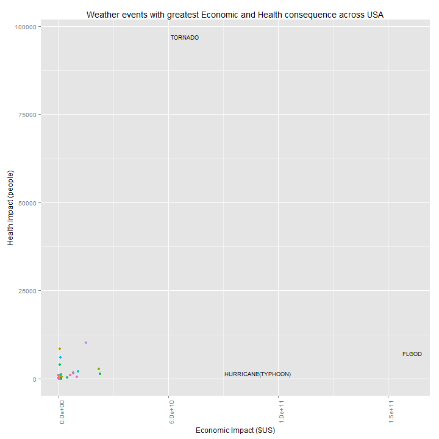
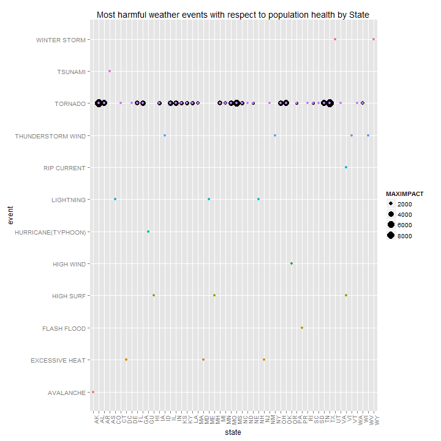
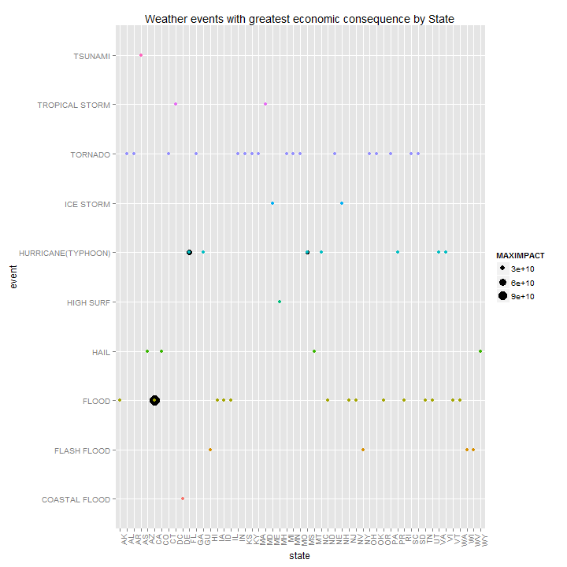

# USA weather event health and economic consequences 
## 1950 - 2011

# SYNOPSIS

This analysis utilizes National Weather Service Storm Data for weather events starting in the year 1950 and ending in November 2011. The purpose of this analysis is to detrmine across the United States which types of weather events are most harmful with respect to population health and which have the greatest economic consequences. This analysis shows **Tornadoes** have the most consequential health impact and **Floods** have the most consequential economic impact between 1950 and November 2011. 

# DATA SOURCE SUMMARY

The National Weather Service Storm Data was sourced from this location:
https://d396qusza40orc.cloudfront.net/repdata%2Fdata%2FStormData.csv.bz2 

# DATA PROCESSING

Rules for processing the data are based upon the following publications:
* National Weather Service Storm Data Documentation: https://d396qusza40orc.cloudfront.net/repdata%2Fpeer2_doc%2Fpd01016005curr.pdf  

* National Climatic Data Center Storm Events FAQ:
https://d396qusza40orc.cloudfront.net/repdata%2Fpeer2_doc%2FNCDC%20Storm%20Events-FAQ%20Page.pdf 

## After running viewUnique function, data exploration reveals:
* high variance in upper and lowercase usage in event, state, and damage multiplier symbol data
* high variance in events (EVTYPE)
* damage multiplier symbols include data outside of symbols specified in NWSI 10-1605
* state abbreviations that do not align with states or territories in the United States

## Data processing tasks are therefore:
* Process data to align with requirements in NWSI 10-1605
* From results of data exploration, the following processing actions are applied:
* Convert event, state and damage multiplier symbol to all caps
* Keep only state abbreviations aligned with US Postal Services USA state and territory abbreviations 
* Keep only damage multiplier symbols that align with NWSI 10-1605 
* Align event types with NWSI 10-1605 Event Names
* Calculate health impact for each record
* Calculate economic impact for each record

## For Population Health analysis:
* FATALITIES - number of people who died as a result of event
* INJURIES - number of people injured as a result of event
* Health impact is the total number of injuries and fatalities
* Calculate Health Impact 

## For Economic impact analysis:
### Property Damage
* PROPDMG - magnitude value of property damage expense
* PROPDMGEXP - dollar multiplier symbol for property damage expense (e.g., K = $1,000)
* PROPDMGMUL - {created variable} convert PROPDMGEXP symbol to value (e.g., if 'K' then 1000)
* PROPIMPACT - {created variable} property damage impact in US$ = PROPDMG * PROPDMGMUL

### Crop Damage
* CROPDMG - magnitude value of property damage expense
* CROPDMGEXP - dollar multiplier symbol for crop damage expense (e.g., K = $1,000)
* CROPDMGMUL - {created variable} convert CROPDMGEXP symbol to value (e.g., if 'K' then 1000)
* CROPIMPACT - {created variable} property damage impact in US$ = CROPDMG * CROPDMGMUL

### Data in these fields will be converted to uppercase where applicable

### Data for analysis is limited to designations defined in NWSI 10-1605 Section 2.7 paragraph 3

### Data set for analysis is limited to the following 

### Symbols Used For Property and Crop Damage: <None>,K,M,B


```r
require(dplyr)
require(data.table)
require(stringr)

## EXECUTE CODE TO PROCESS DATA
# downloadfile() # download NWS data
downloadstates() # download USPS states abbreviation file
readData() # read data and create STORMDATA data frame
processData() # process data per tasks noted above 

### Load Data 

## Download storm data file 

downloadfile <- function(){
  
  fileURL = "http://d396qusza40orc.cloudfront.net/repdata%2Fdata%2FStormData.csv.bz2"
  destination = "./StormData.csv.bz2"
  
  ## copy storm data file from internet to working directory
  download.file(url=fileURL,destfile=destination)
   
}

## get state abbreviation file for verification of STATE field
downloadstates <- function(){
  
  ## copy state abbreviation file from internet to working directory
  fileURL = "http://mydatamaster.com/wp-content/files/state-abbreviations.zip"
  destination = "./state-abbreviations.zip"
  download.file(url=fileURL,destfile=destination)
  
  unzip(destination)
}

## Check if data frame exists 
dfExists <- function(df_name){
  
  ## If dataframe exists then return TRUE
  ## If dataframe does not exist then return FALSE
  return(exists(df_name) && is.data.frame(get(df_name)))
  
}

## Create data frame from file in working directory if data frame does not exist
readData <- function(){
  
  ## Read storm data if data frame does not exist
  
  if(dfExists('STORMDATA') == FALSE ){
    
    ## write dataframe to global environment
    filename = "./StormData.csv.bz2"   
    
    fieldstoread <- c('STATE','EVTYPE','FATALITIES','INJURIES','CROPDMG','CROPDMGEXP','PROPDMG','PROPDMGEXP')
    
    STORMDATA <<- read.csv(bzfile(filename))[,fieldstoread]
    
    filename = "./USPS State Abbreviations.csv"
    STATEABR <<- read.csv(filename)
    
  }
  
}

### Process Data

## Explore data for unique factor values

require(dplyr)
require(data.table)
require(stringr)

viewUnique<-function(){
  datatable <- data.table(STORMDATA)
  byState <- datatable[,.N,by=STATE]
  byEvent <- datatable[,.N,by=EVTYPE]
  byPROP <- datatable[,.N,by=PROPDMGEXP]
  byCROP <- datatable[,.N,by=CROPDMGEXP]
  
  ## View in descending order
  View(byState[order(N,decreasing=TRUE), ], "STATE")
  View(byEvent[order(EVTYPE,decreasing=TRUE), ], "EVTYPE")
  View(byPROP[order(N,decreasing=TRUE), ], "PROPDMGEXP")
  View(byCROP[order(N,decreasing=TRUE), ], "CROPDMGEXP")
  
}


processData<-function(){
  
  ## Variables needed for analysis
  
  ## For Population Health and Economic impact analyses:
   
  ## STATE - name of the state (e.g., AL for Alabama)
  ## If record STATE field contains an abbreviation in USPS State Abbreviations file
  ## then record is retained for analysis
  
  ## Convert STATE data to upper case to align with State Abbreviation file
  STORMDATA <<- mutate(STORMDATA, STATE = toupper(STATE))
  
  ## Limit analysis data to STATE values in State Abbreviation file
  STORMDATA <<- STORMDATA[STORMDATA$STATE %in% STATEABR$Abbreviation, ]
  
 
  
  ## For Population Health analysis:
    ## FATALITIES - number of people who died as a result of event
    ## INJURIES - number of people injured as a result of event
    ## Health impact is the total number of injuries and fatalities
  
  ## Calculate Health Impact 
  STORMDATA <<- mutate(STORMDATA, HEALTHIMPACT = FATALITIES + INJURIES)
  
  ## For Economic impact analysis:
      
    ## Property Damage
    ## PROPDMG - magnitude value of property damage expense
    ## PROPDMGEXP - dollar multiplier symbol for property damage expense (e.g., K = $1,000)
    ## PROPDMGMUL - {created variable} convert PROPDMGEXP symbol to value (e.g., if 'K' then 1000)
    ## PROPIMPACT - {created variable} property damage impact in US$ = PROPDMG * PROPDMGMUL
    
    ## Crop Damage
    ## CROPDMG - magnitude value of property damage expense
    ## CROPDMGEXP - dollar multiplier symbol for crop damage expense (e.g., K = $1,000)
    ## CROPDMGMUL - {created variable} convert CROPDMGEXP symbol to value (e.g., if 'K' then 1000)
    ## CROPIMPACT - {created variable} property damage impact in US$ = CROPDMG * CROPDMGMUL
    
    ## Data in these fields will be converted to uppercase where applicable
    ## Data for analysis is limited to designations defined in NWSI 10-1605 Section 2.7 paragraph 3
    ## Data set for analysis is limited to the following 
    ## Symbols Used For Property and Crop Damage 
    ## XXXXDMGEXP | XXXXDMGMUL
    ## ========== | =========
    ##                1
    ##    K           1000
    ##    M           1000000
    ##    B           1000000000
    ##
  
  ## Based upon viewing unique factor values
  ## Convert CROPDMGEXP and PROPDMGEXP to upper case
  
  STORMDATA <<- mutate(STORMDATA, CROPDMGEXP = str_trim(toupper(CROPDMGEXP)))
  STORMDATA <<- mutate(STORMDATA, PROPDMGEXP = str_trim(toupper(PROPDMGEXP)))
  
  ## Limit analysis data to CROPDMGEXP & PROPDMGEXP values of K, M, or B
  
  cDMG <- c('','K','M','B')
  
  STORMDATA <<- STORMDATA[STORMDATA$CROPDMGEXP %in% cDMG, ]
  STORMDATA <<- STORMDATA[STORMDATA$PROPDMGEXP %in% cDMG, ]
  
  ## Calculate multiplier value for each record and add to data as PROPDMGMUL OR CROPDMGMUL field
  STORMDATA <<- mutate(STORMDATA, PROPDMGMUL = as.integer(applygetdmgexpvalue(PROPDMGEXP)))
  STORMDATA <<- mutate(STORMDATA, CROPDMGMUL = as.integer(applygetdmgexpvalue(CROPDMGEXP)))
 
  ## Calculate damage value 
  STORMDATA <<- mutate(STORMDATA, PROPDMGVAL = PROPDMG * PROPDMGMUL)
  STORMDATA <<- mutate(STORMDATA, CROPDMGVAL = CROPDMG * CROPDMGMUL)
  
  # calculate economic impact
  STORMDATA <<- mutate(STORMDATA, ECONIMPACT = PROPDMGVAL + CROPDMGVAL)
  
  ## EVTYPE - event type (e.g, TORNADO)
  
  ## Convert EVTYPE to all uppercase
  STORMDATA <<- mutate(STORMDATA, EVTYPE = str_trim(toupper(EVTYPE)))
  
  ## Limit analysis data to Event Names per NWSI 10-1605 Section 2.1.1 Storm Data Event Table 
  
  ## Create Event Name field to align EVTYP data with NWSI 10-1605 Event Names
  STORMDATA <<- mutate(STORMDATA,EVENTNAME = applygetEventType(EVTYPE))
  
}

## Input EVTYPE to return Event Name per NWSI 10-1605 Section 2.1.1 Storm Data Event Table 

getEventType <- function(x){
  
  if(grepl("^ASTRONOMICAL LOW TIDE",x)==TRUE){
    
    return("ASTRONOMICAL LOW TIDE")
  }
  
  if(grepl("^AVALANCHE",x)==TRUE){
    
    return("AVALANCHE")
  }
  
  if(grepl("^BLIZZARD",x)==TRUE){
    
    return("BLIZZARD")
  }
  
  if(grepl("^COASTAL FLOOD",x)==TRUE){
    
    return("COASTAL FLOOD")
  }
  
  if(grepl("^COLD WIND CHILL",x)==TRUE){
    
    return("COLD/WIND CHILL")
  }
  
  if(grepl("^DEBRIS",x)==TRUE){
    
    return("DEBRIS FLOW")
  }
  
  if(grepl("^DENSE FOG",x)==TRUE){
    
    return("DENSE FOG")
  }
  
  if(grepl("^DENSE SMOKE",x)==TRUE){
    
    return("DENSE SMOKE")
  }
  
  if(grepl("^EXCESSIVE HEAT",x)==TRUE){
    
    return("EXCESSIVE HEAT")
  }
  
  if(grepl("^EXTREME COLD",x)==TRUE){
    
    return("EXTREME COLD/WIND CHILL")
  }
  
  if(grepl("FLASH FLOOD",x)==TRUE){
    
    return("FLASH FLOOD")
  }
  
 
  
  if(grepl("FROST",x)==TRUE){
    
    return("FROST/FREEZE")
  }
  
  
  if(grepl("^FREEZING FOG",x)==TRUE){
    
    return("FREEZING FOG")
  }
      
  if(grepl("HEAT",x)==TRUE){
    
    return("HEAT")
  }
  
  if(grepl("^HEAVY RAIN",x)==TRUE){
    
    return("HEAVY RAIN")
  }
  
  if(grepl("^HEAVY SNOW",x)==TRUE){
    
    return("HEAVY SNOW")
  }
  
  if(grepl("^HIGH SURF",x)==TRUE){
    
    return("HIGH SURF")
  }
  
  if(grepl("HURRICANE",x)==TRUE || grepl("TYPHOON",x)==TRUE ){
    
    return("HURRICANE(TYPHOON)")
  }
  
  if(grepl("ICE STORM",x)==TRUE){
    
    return("ICE STORM")
  }
  
  if(grepl("^LAKE EFFECT SNOW",x)==TRUE){
    
    return("LAKE EFFECT SNOW")
  }
  
  if(grepl("^LAKESHORE FLOOD",x)==TRUE){
    
    return("LAKESHORE FLOOD")
  }
  
  if(grepl("LIGHTNING",x)==TRUE){
    
    return("LIGHTNING")
  }
  
  if(grepl("^MARINE HAIL",x)==TRUE){
    
    return("MARINE HAIL")
  }
  
  if(grepl("^MARINE HIGH WIND",x)==TRUE){
    
    return("MARINE HIGH WIND")
  }
  
  if(grepl("^MARINE STRONG WIND",x)==TRUE){
    
    return("MARINE STRONG WIND")
  }
  
  if(grepl("^MARINE THUNDERSTORM WIND ",x)==TRUE || grepl("^MARINE TSTM WIND",x)==TRUE){
    
    return("MARINE THUNDERSTORM WIND")
  }
  
  if(grepl("^RIP CURRENT",x)==TRUE){
    
    return("RIP CURRENT")
  }
  
  if(grepl("^SEICHE",x)==TRUE){
    
    return("SEICHE")
  }
  
  if(grepl("SLEET",x)==TRUE){
    
    return("SLEET")
  }
  
  if(grepl("^STORM SURGE TIDE",x)==TRUE){
    
    return("STORM SURGE TIDE")
  }
  
  if(grepl("STRONG WIND",x)==TRUE){
    
    return("STRONG WIND")
  }
  
  if(grepl("THUNDERSTORM WIND",x)==TRUE || grepl("THUNDERSTORMS WIND",x)==TRUE || grepl("TSTM WIND",x)==TRUE ){
    
    return("THUNDERSTORM WIND")
  }
  
  if(grepl("TORNADO",x)==TRUE){
    
    return("TORNADO")
  }
  
  if(grepl("^TROPICAL DEPRESSION",x)==TRUE){
    
    return("TROPICAL DEPRESSION")
  }
  
  if(grepl("^TROPICAL STORM",x)==TRUE){
    
    return("TROPICAL STORM")
  }
  
  if(grepl("TSUNAMI",x)==TRUE){
    
    return("TSUNAMI")
  }
  
  if(grepl("^VOLCANIC ASH",x)==TRUE){
    
    return("VOLCANIC ASH")
  }
  
  if(grepl("WATERSPOUT",x)==TRUE){
    
    return("WATERSPOUT")
  }
  
  if(grepl("WILDFIRE",x)==TRUE){
    
    return("WILDFIRE")
  }
  
  if(grepl("WINTER STORM",x)==TRUE){
    
    return("WINTER STORM")
  }
  
  if(grepl("^WINT",x)==TRUE || grepl("SNOW",x)==TRUE && grepl("DROUGHT",x)==FALSE){
    
    return("WINTER WEATHER")
  }
  
  if(grepl("^HIGH WIND",x)==TRUE){
    
    return("HIGH WIND")
  }
  
  if(grepl("HAIL",x)==TRUE){
    
    return("HAIL")
  }
  
  if(grepl("FLOOD",x)==TRUE){
    
    return("FLOOD")
  }
  
  return("UNDEFINED")
}

applygetEventType <- function(vec){
  
  sapply(vec,function(x) getEventType(x))
  
}

## returns numeric value that aligns with CROPDMGEXP or PROPDMGEXP code
getdmgexpvalue <- function(x){
  
  ## Symbols Used For Property and Crop Damage per NWSI 10-1605
  ## XXXXDMGEXP | XXXXDMGMUL
  ## ========== | =========
  ##                1
  ##    K           1000
  ##    M           1000000
  ##    B           1000000000
  
  if(x=='K'){
    
    return(1000)
  } 
  
  if(x=='M'){
    
    return(1000000)
  }
  
  if(x=='B'){
    
    return(1000000000)
  }
  
  return(1) 
}

applygetdmgexpvalue <- function(vec){
  
  sapply(vec,function(x) getdmgexpvalue(x))
  
}
```

# RESULTS


### Organize data to show results


```r
require(dplyr)
require(data.table)
require(stringr)
require(ggplot2)

### Results


## Organize data to show results
organizedataforresults()

organizedataforresults<-function(){

## Group data by state
statedata <<- group_by(STORMDATA,STATE,EVENTNAME) 

## sort data by highest to lowest health impact
healthdata <<- arrange(statedata,desc(HEALTHIMPACT))

## sort data by highest to lowest economic impact
econdata <<- arrange(statedata,desc(ECONIMPACT))
}
```


### Across the United States, which type of events are most harmful w/rt population health?
### Population Health Impact = Fatalities + Injuries

### Across the United States, which types of events have the greatest economic consequences?
### Economic Impact = Property Damage + Crop Damage


```r
require(dplyr)
require(data.table)
require(stringr)
require(ggplot2)

plotusasummary() ## plot summary at USA level showing Health Impact & Economic Impact relationship
```

 

```r
plotusasummary <- function(){
  
  ## Group data by USA
  usadata <<-group_by(STORMDATA,EVENTNAME)
  
  
  plotdata <- summarize(usadata,HEALTHIMPACT = sum(HEALTHIMPACT), ECONIMPACT = sum(ECONIMPACT))
  plotdata <- plotdata[plotdata$EVENTNAME!='UNDEFINED', ]
  
  theplot <- ggplot(plotdata, aes(x=ECONIMPACT, y=HEALTHIMPACT))
  theplot <- theplot + geom_point()
  theplot <- theplot + geom_text(aes(label=ifelse(ECONIMPACT>5.0e+10,EVENTNAME,''))
                                 ,hjust=0.5,just=0,size=3,angle = 0)
  theplot <- theplot + theme(axis.text.x = element_text(angle=90, hjust=0))
  theplot <- theplot + geom_point(aes(color = factor(EVENTNAME)))
  theplot <- theplot + ggtitle("Weather events with greatest Economic and Health consequence across USA")
  theplot <- theplot + guides(color=FALSE)
  theplot <- theplot + ylab("Health Impact (people)")
  theplot <- theplot + xlab("Economic Impact ($US)")
  theplot
  
}
```

### By State, which type of events are most harmful w/rt population health?
### Population Health Impact = Fatalities + Injuries


```r
require(dplyr)
require(data.table)
require(stringr)
require(ggplot2)

plothealthresults() ## Plot weather event health impact by state
```

 

```r
plothealthresults <- function(){
  
  plotdata <- summarize(healthdata,STATEHEALTHIMPACT = sum(HEALTHIMPACT))
  plotdata <- mutate(plotdata,MAXIMPACT = max(STATEHEALTHIMPACT))
  plotdata <- plotdata[plotdata$STATEHEALTHIMPACT == plotdata$MAXIMPACT, ]
  plotdata <- plotdata[plotdata$EVENTNAME!='UNDEFINED', ]
  plotdata <- plotdata[order(plotdata$EVENTNAME,-plotdata$MAXIMPACT), ]
    
  
  theplot <- ggplot(plotdata, aes(x=STATE, y=EVENTNAME))
  theplot <- theplot + geom_point(stat="identity")
  theplot <- theplot + geom_point(aes(size=MAXIMPACT))+scale_size_area()
  theplot <- theplot + geom_point(aes(color = factor(EVENTNAME)))
  theplot <- theplot + ggtitle("Most harmful weather events with respect to population health by State")
  theplot <- theplot + guides(color=FALSE)
  theplot <- theplot + xlab("state")
  theplot <- theplot + ylab("event")
  theplot <- theplot + theme(axis.text.x = element_text(angle=90, hjust=1))

theplot

}
```


### By state, which types of events have the greatest economic consequences?
### Economic Impact = Property Damage + Crop Damage


```r
require(dplyr)
require(data.table)
require(stringr)
require(ggplot2)

ploteconresults() ## Plot economic event health impact by state
```

 

```r
ploteconresults <- function(){
  
  plotdata <- summarize(econdata,STATEECONIMPACT = sum(ECONIMPACT))
  plotdata <- mutate(plotdata,MAXIMPACT = max(STATEECONIMPACT))
  plotdata <- plotdata[plotdata$STATEECONIMPACT == plotdata$MAXIMPACT, ]
  plotdata <- plotdata[plotdata$EVENTNAME!='UNDEFINED', ]
  plotdata <- plotdata[order(plotdata$EVENTNAME,-plotdata$MAXIMPACT), ]
    
  theplot <- ggplot(plotdata, aes(x=STATE, y=EVENTNAME))
  theplot <- theplot + geom_point(stat="identity")
  theplot <- theplot + geom_point(aes(size=MAXIMPACT))+scale_size_area()
  theplot <- theplot + geom_point(aes(color = factor(EVENTNAME)))
  theplot <- theplot + ggtitle("Weather events with greatest economic consequence by State")
  theplot <- theplot + guides(color=FALSE)
  theplot <- theplot + xlab("state")
  theplot <- theplot + ylab("event")
  theplot <- theplot + theme(axis.text.x = element_text(angle=90, hjust=1))
  
  theplot
  
}
```
